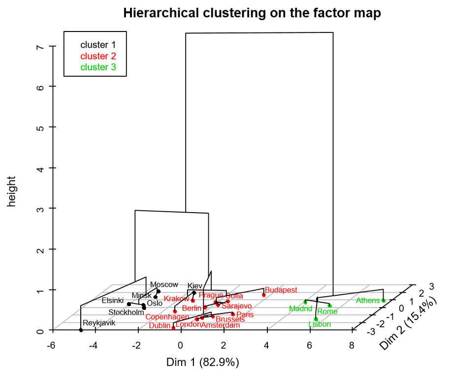

# Data Visualization Challenge using R
<a href = "https://lovetoken.github.io">lovetoken</a>  
`r Sys.Date()`  

 

감명깊었던 데이터 시각화 결과물을 모아놓고 직접 R을 통해 시각화를 구현을 도전하는 곳 입니다.

  

# 도전중

현재 도전하고 있는 것은 아래의 것들이 있습니다.  

 

## Sankey diagram

> [Histograms, Boxes and Whiskers](http://blog.threestory.com/wordpress/topics/data-visualization) 중 

 

## Cube style response rate

> 출처 알수없음

 

## Hierarchical clustering on the factor map

> [PCA – hierarchical tree – partition: Why do we need to choose for visualizing data?](https://www.r-bloggers.com/pca-hierarchical-tree-partition-why-do-we-need-to-choose-for-visualizing-data/?utm_source=feedburner&utm_medium=email&utm_campaign=Feed%3A+RBloggers+%28R+bloggers%29) 중

  

# 성공한 것들

도전에 성공한 것은 `archive` 디렉토리에 정리될 것입니다.
