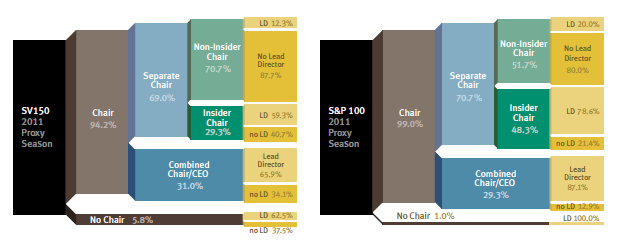
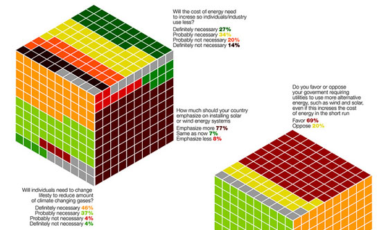

# Data Visualization Challenge using R
<a href = "https://lovetoken.github.io">lovetoken</a>  
`r Sys.Date()`  

 

감명깊었던 데이터 시각화 결과물을 모아놓고 직접 R을 통해 시각화를 구현을 도전하는 곳 입니다.

  

# 도전중

현재 도전하고 있는 것은 아래의 것들이 있습니다.  

## Sankey diagram

> [Histograms, Boxes and Whiskers](http://blog.threestory.com/wordpress/topics/data-visualization) 중 

## Cube style response rate

> 출처 알수없음

  

# 성공한 것들

도전에 성공한 것은 `archive` 디렉토리에 정리될 것입니다.
