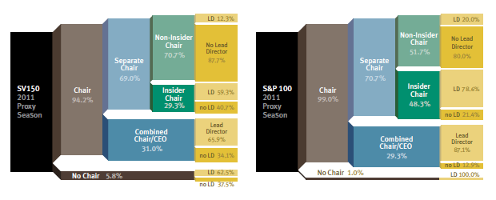
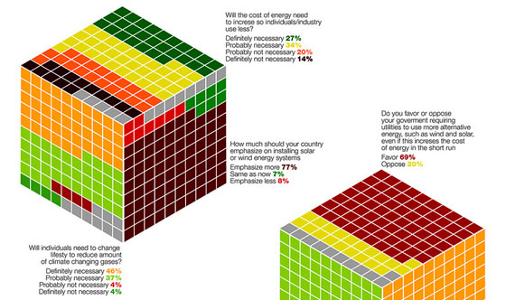

<style type="text/css">@import url("https://maxcdn.bootstrapcdn.com/bootswatch/3.3.7/yeti/bootstrap.min.css")</style><br>

```{r env, echo = F, warning = F, message = F}
## attach library
pacman::p_load("useful.lovetoken", "knitr", "dplyr", "ggplot2", "data.table")
opts_chunk$set(fig.path = "output/figure/", fig.align = "center", out.width = "80%", 
               warning = F, message = F)
```

감명깊었던 데이터 시각화 결과물을 모아놓고 직접 R을 통해 시각화를 구현을 도전하는 곳 입니다.

<br><br>

# 도전중

현재 도전하고 있는 것은 아래의 것들이 있습니다.  

## Sankey diagram

> [Histograms, Boxes and Whiskers](http://blog.threestory.com/wordpress/topics/data-visualization) 중 



## Cube style response rate

> 출처 알수없음



<br><br>

# 성공한 것들

도전에 성공한 것은 `archive` 디렉토리에 정리될 것입니다.