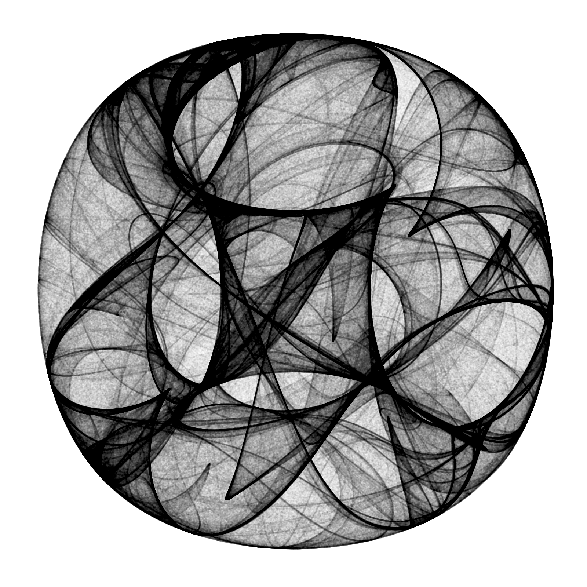

<br><br>

## Rose plot 

### Using ggplot2 package


```r
d <- data.frame(Angle = 0:35*10, Rate = abs(rnorm(36)))

ggplot(d, aes(x = Angle, y = Rate)) +
  coord_polar(theta = "x", start = -pi/36) +
  geom_bar(stat = "identity") +
  scale_x_continuous(breaks = seq(0, 360, 30))
```


<br>

### Using circular package


```r
x <- circular(runif(50, 0, 2*pi))
rose.diag(x, bins = 18, main = 'Uniform Data')
points(x)
```


<br><br>

## Geo Visualization

### Using leaflet package


```r
data(quakes)

leaflet(data = sample_n(quakes, 50)) %>% 
  addTiles() %>%
  addMarkers(~long, ~lat, popup = ~as.character(mag), label = ~as.character(mag))
```

<!--html_preserve--><div id="htmlwidget-1689b494b74ac2feeecd" style="width:80%;height:576px;" class="leaflet html-widget"></div>
<script type="application/json" data-for="htmlwidget-1689b494b74ac2feeecd">{"x":{"options":{"crs":{"crsClass":"L.CRS.EPSG3857","code":null,"proj4def":null,"projectedBounds":null,"options":{}}},"calls":[{"method":"addTiles","args":["//{s}.tile.openstreetmap.org/{z}/{x}/{y}.png",null,null,{"minZoom":0,"maxZoom":18,"maxNativeZoom":null,"tileSize":256,"subdomains":"abc","errorTileUrl":"","tms":false,"continuousWorld":false,"noWrap":false,"zoomOffset":0,"zoomReverse":false,"opacity":1,"zIndex":null,"unloadInvisibleTiles":null,"updateWhenIdle":null,"detectRetina":false,"reuseTiles":false,"attribution":"&copy; <a href=\"http://openstreetmap.org\">OpenStreetMap<\/a> contributors, <a href=\"http://creativecommons.org/licenses/by-sa/2.0/\">CC-BY-SA<\/a>"}]},{"method":"addMarkers","args":[[-24.6,-18.97,-15.45,-19.15,-19.89,-27.33,-20.68,-19.3,-22.82,-27.98,-12.23,-25.8,-26.18,-18.12,-37.03,-26.16,-17.9,-20.94,-22.36,-20.08,-18.69,-27.28,-18.85,-11.76,-23.31,-16.4,-19.02,-20.32,-15.26,-11.41,-11.63,-21.54,-23.64,-19.3,-23.45,-19.22,-19.85,-19.5,-26.54,-18.04,-26.5,-21.29,-19.88,-27.2,-20.9,-15.29,-26.6,-15.48,-11.7,-20.1],[183.5,169.44,186.73,169.5,174.46,182.6,181.41,183.84,184.52,181.96,167.02,182.1,178.59,181.88,177.52,179.5,181.5,181.26,171.65,182.74,169.1,183.4,187.55,165.96,179.27,182.73,186.83,180.88,183.13,166.24,166.14,185.48,179.96,183,180.23,182.43,181.85,186.9,183.63,181.75,178.29,185.8,184.3,182.39,182.02,186.42,182.77,167.53,166.1,186.3],null,null,null,{"clickable":true,"draggable":false,"keyboard":true,"title":"","alt":"","zIndexOffset":0,"opacity":1,"riseOnHover":false,"riseOffset":250},["4.3","5","4.7","4.2","5.7","4.4","4.9","4.2","5","5.2","6","4.5","5.4","5.4","5.6","4.5","4","4.4","4.6","4.5","4.2","5.1","4.8","4.4","5.1","4","5.2","4.2","4.4","5.3","4.6","5","4.5","5","4.2","4.5","4.9","4.4","4.7","4.5","5","4.9","4.4","4.3","4.3","4.6","4.5","5.1","4.8","4.6"],null,null,null,["4.3","5","4.7","4.2","5.7","4.4","4.9","4.2","5","5.2","6","4.5","5.4","5.4","5.6","4.5","4","4.4","4.6","4.5","4.2","5.1","4.8","4.4","5.1","4","5.2","4.2","4.4","5.3","4.6","5","4.5","5","4.2","4.5","4.9","4.4","4.7","4.5","5","4.9","4.4","4.3","4.3","4.6","4.5","5.1","4.8","4.6"],null,null]}],"limits":{"lat":[-37.03,-11.41],"lng":[165.96,187.55]}},"evals":[],"jsHooks":[]}</script><!--/html_preserve-->

## Art Visualization

### Drawing 10 Million Points

> (Drawing 10 Million Points With ggplot: Clifford Attractors)[https://www.r-bloggers.com/drawing-10-million-points-with-ggplot-clifford-attractors/?utm_source=feedburner&utm_medium=email&utm_campaign=Feed%3A+RBloggers+%28R+bloggers%29]


```r
library(Rcpp)
library(ggplot2)
library(dplyr)

opt = theme(legend.position  = "none",
            panel.background = element_rect(fill="white"),
            axis.ticks       = element_blank(),
            panel.grid       = element_blank(),
            axis.title       = element_blank(),
            axis.text        = element_blank())

cppFunction('DataFrame createTrajectory(int n, double x0, double y0, 
            double a, double b, double c, double d) {
            // create the columns
            NumericVector x(n);
            NumericVector y(n);
            x[0]=x0;
            y[0]=y0;
            for(int i = 1; i < n; ++i) {
            x[i] = sin(a*y[i-1])+c*cos(a*x[i-1]);
            y[i] = sin(b*x[i-1])+d*cos(b*y[i-1]);
            }
            // return a new data frame
            return DataFrame::create(_["x"]= x, _["y"]= y);
            }
            ')

a=-1.24458046630025
b=-1.25191834103316 
c=-1.81590817030519 
d=-1.90866735205054

df=createTrajectory(10000000, 0, 0, a, b, c, d)

png("Clifford.png", units="px", width=1600, height=1600, res=300)
ggplot(df, aes(x, y)) + geom_point(color="black", shape=46, alpha=.01) + opt
dev.off()
```


