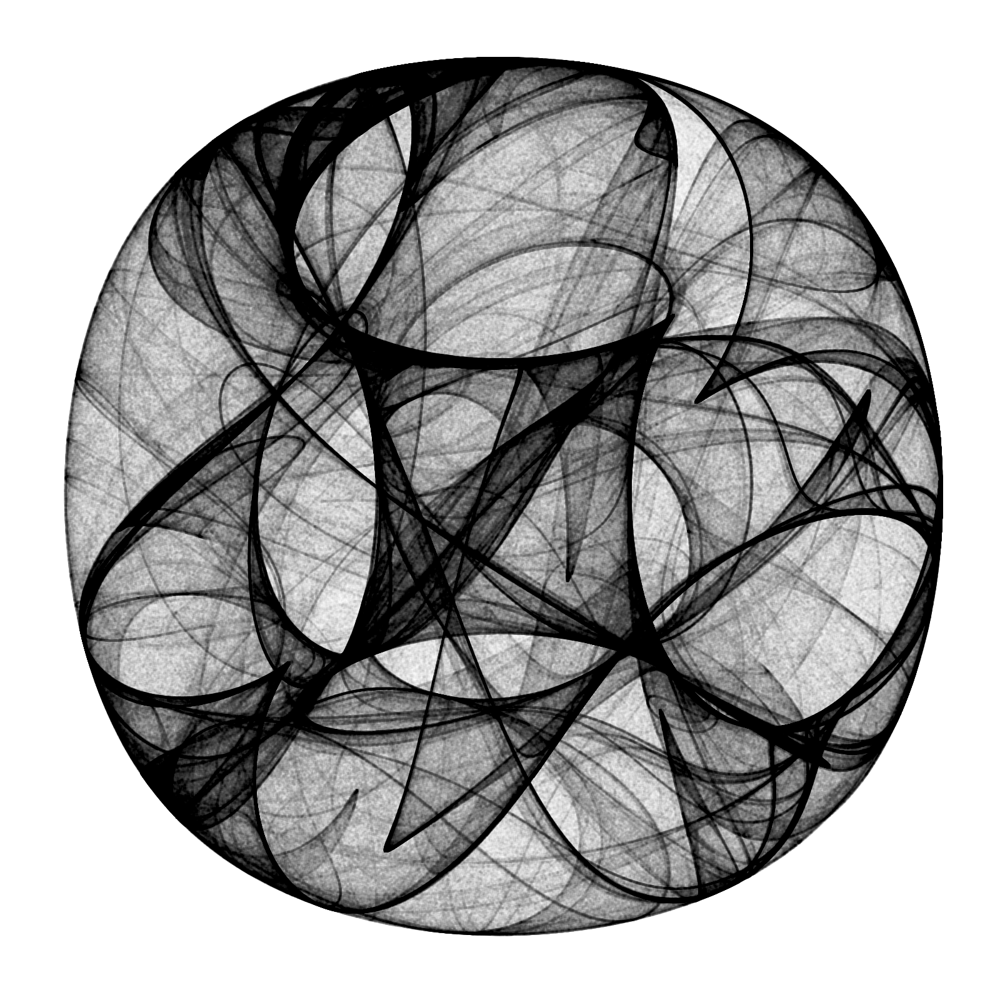

```{r env, echo = F, warning = F, message = F}
pacman::p_load("knitr", "tidyverse", "ggplot2", "data.table", "spatial", "circular", "ggmap", "leaflet")
opts_chunk$set(fig.path = "output/figure/", fig.align = "center", out.width = "80%", warning = F, message = F)
```

<br><br>

## Rose plot 

### Using ggplot2 package

```{r}
d <- data.frame(Angle = 0:35*10, Rate = abs(rnorm(36)))

ggplot(d, aes(x = Angle, y = Rate)) +
  coord_polar(theta = "x", start = -pi/36) +
  geom_bar(stat = "identity") +
  scale_x_continuous(breaks = seq(0, 360, 30))
```

<br>

### Using circular package

```{r}
x <- circular(runif(50, 0, 2*pi))
rose.diag(x, bins = 18, main = 'Uniform Data')
points(x)
```

<br><br>

## Geo Visualization

### Using leaflet package

```{r}
data(quakes)

leaflet(data = sample_n(quakes, 50)) %>% 
  addTiles() %>%
  addMarkers(~long, ~lat, popup = ~as.character(mag), label = ~as.character(mag))
```

## Art Visualization

### Drawing 10 Million Points

> (Drawing 10 Million Points With ggplot: Clifford Attractors)[https://www.r-bloggers.com/drawing-10-million-points-with-ggplot-clifford-attractors/?utm_source=feedburner&utm_medium=email&utm_campaign=Feed%3A+RBloggers+%28R+bloggers%29]

```{r eval = F}
library(Rcpp)
library(ggplot2)
library(dplyr)

opt = theme(legend.position  = "none",
            panel.background = element_rect(fill="white"),
            axis.ticks       = element_blank(),
            panel.grid       = element_blank(),
            axis.title       = element_blank(),
            axis.text        = element_blank())

cppFunction('DataFrame createTrajectory(int n, double x0, double y0, 
            double a, double b, double c, double d) {
            // create the columns
            NumericVector x(n);
            NumericVector y(n);
            x[0]=x0;
            y[0]=y0;
            for(int i = 1; i < n; ++i) {
            x[i] = sin(a*y[i-1])+c*cos(a*x[i-1]);
            y[i] = sin(b*x[i-1])+d*cos(b*y[i-1]);
            }
            // return a new data frame
            return DataFrame::create(_["x"]= x, _["y"]= y);
            }
            ')

a=-1.24458046630025
b=-1.25191834103316 
c=-1.81590817030519 
d=-1.90866735205054

df=createTrajectory(10000000, 0, 0, a, b, c, d)

png("Clifford.png", units="px", width=1600, height=1600, res=300)
ggplot(df, aes(x, y)) + geom_point(color="black", shape=46, alpha=.01) + opt
dev.off()
```

